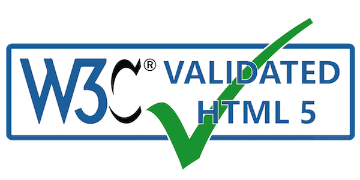
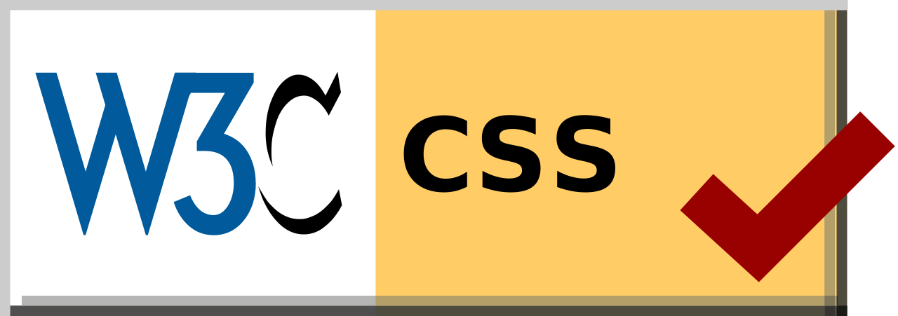

title:Info

# Informazioni sull'accesibilità del sito

## Dichiarazione di conformità

-   Data della dichiarazione: 15/07/2019

-   Nome delle linee guida, versione e URI: "Web Content Accessibility Guidelines **WCAG 2.1** su [W3C](https://www.w3.org/Translations/WCAG21-it/)

-   Livello di conformità soddisfatto: Livello AA

-   Tecnologie usate per i contenuti Web: [HTML5](https://w3c.github.io/html/), [CSS3](https://www.w3.org/TR/css3-roadmap/#intro), [JavaScript](https://www.ecma-international.org/ecma-262/), [Go Language](https://golang.org/)

### Validazione del codice

La validità del markup di questo documento Web è stata verificata con lo strumento [Markup Validation Service](https://validator.w3.org/)

La validità dei fogli di stile a cascata (CSS) è stata verificata con lo strumento [CSS Validation Service](http://jigsaw.w3.org/css-validator/)

#### Scorciatoie da tastiera

In questa sezione sono elencate le combinazioni da tastiera che possono essere utilizzate in Mozilla Firefox e Google Chrome

